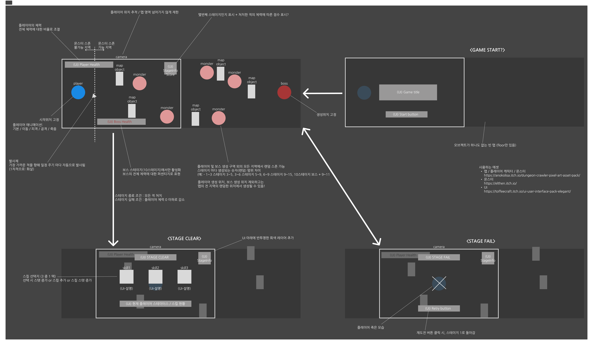
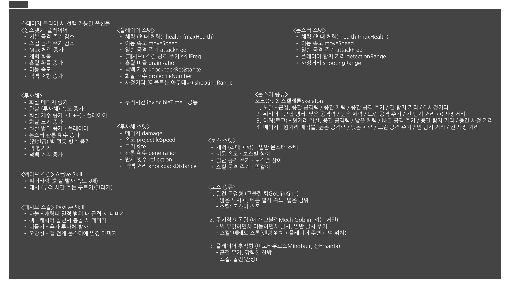
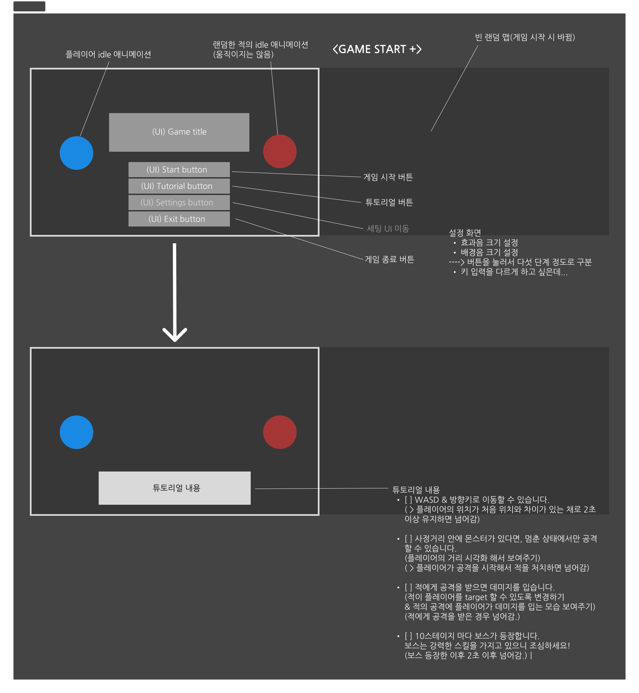
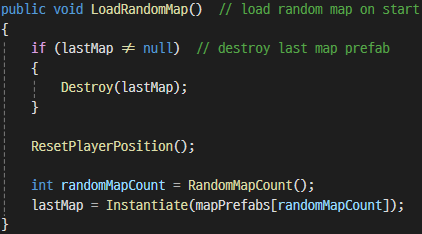
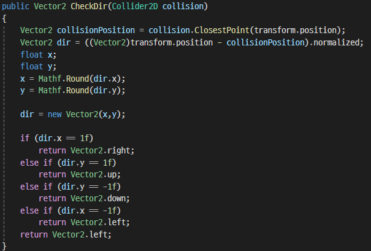
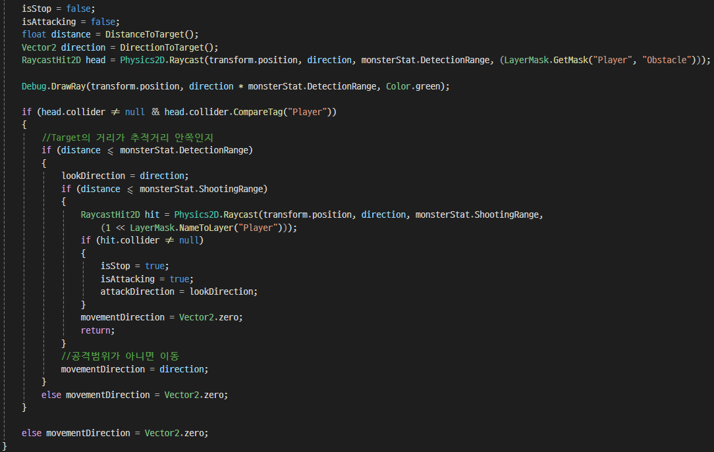

# SpartanArcher
스파르타 내일배움캠프에서 Unity 기능을 익히기 위해 궁수의 전설을 레퍼런스로 진행한 팀 프로젝트입니다.

  
----
  
## 📌 프로젝트 개요
  
- **프로젝트**: Spartan Archer Project  
- **개발환경**: Unity, C#  
- **개발인원**: 4명 (손치완, 서상원, 강기수, 정형권)  
- **타임라인**:  
  🔹25.02.21 (금) 프로젝트 시작, 게임 기획 및 와이어프레임 작성.  
  🔹25.02.27 (목) 프로젝트 v1.0 완성.  
  🔹25.02.28 (금) 프로젝트 v2.0 완성.  
  🔹25.02.28 (금) 프로젝트 v2.2 빌드.  
- **주요기능**:  
  튜토리얼 진행, 랜덤 맵 생성, 랜덤 몬스터 생성, 플레이어의 스킬 선택, 액티브 스킬 사용, 플레이어 및 몬스터 움직임 컨트롤, 보스의 공격 패턴 구현, Excel과 JSON을 통한 데이터 관리  
  
----
  
## 🧑‍🤝‍🧑 팀원 소개 및 역할 분담
  
살려주세요! 우리의 코딩을 살려주세요!
| 이름 | 역할 | 상세 내용 |
| ---- | ---- | ---- |
| 손치완 | - 게임 진행 구현.  - 무작위 맵/몬스터 관리.  - UI 제작 및 관리.  - 튜토리얼 제작. | - 게임의 전체적인 진행과 다양한 화면에 대응하는 UI를 제작했습니다.  - 매 스테이지를 시작할 때마다 무작위 맵을 선택하여 표시하도록 했습니다.  - 매 스테이지를 시작할 때마다 무작위 숫자의 랜덤한 몬스터가 생성되도록 구현했습니다.  - 게임의 기본적인 진행 방식을 소개하기 위한 튜토리얼을 제작했습니다.  - 설정 메뉴를 제작하고, 볼륨 조절 및 조작키 변경 등이 가능하도록 구현했습니다. |
| 서상원 | - 몬스터 행동 구현.  - 보스 몬스터 행동 구현 및 공격 패턴 구성. | - 몬스터의 행동(이동, 바라보기, 공격, 피격, 죽음 등)에 대한 로직을 제작했습니다.  - 여러 보스 몬스터의 다양한 패턴을 구상했습니다.  - 몬스터의 다양한 공격 패턴을 게임 내에서 구현했습니다. |
| 강기수 | - 엔티티 행동 구현.  - 플레이어 행동 구현.  - QA 및 레벨 밸런스 조정 | - 플레이어와 몬스터의 기본적인 행동(이동, 바라보기, 공격, 피격, 죽음 등)에 대한 스크립트를 작성했습니다.  - 플레이어 캐릭터의 직접적인 행동을 구현했습니다.  - 캐릭터의 행동을 표현하기 위한 스프라이트를 관리하고, 애니메이션을 제작했습니다.  - 버그를 찾아내며 게임의 원활한 흐름을 도왔고, 플레이어 및 몬스터 스탯 등에 대해 지속적으로 작업하면서 레벨 및 밸런스를 조정했습니다. |
| 정형권 | - 발사체 제작.  - 스킬 셋 제작 및 선택 구현. | - 발사체의 행동(생성, 이동, 파괴 등)을 구현했습니다.  - 발사체의 행동에 따른 이미지 스프라이트를 관리하고, 애니메이션을 제작했습니다.  - 플레이어가 선택할 수 있는 스킬 세트를 Scriptable Object로 제작하고, JSON으로 관리했습니다.  - 플레이어가 스킬을 선택했을 때 관련 수치가 변화하는 로직을 제작했습니다. |
  
----
  
## 🎮 게임 설명
  
탑다운 형식의 스테이지 클리어 로그라이크 슈팅 게임으로 2D를 기반으로 만들었습니다.  
화면 비율은 16:9 이며 좌우로 진행하는 방식입니다. 
  
----
  
## 📖 와이어프레임
  
#### 1️⃣ 1차 와이어프레임
필수 기능을 구현하기 위해 1차적으로 다음과 같은 와이어프레임을 작성했습니다. 또한, 회의를 통해 여러 엔티티들의 스테이터스와 몬스터 및 보스의 종류 등을 미리 결정했습니다.  
  
  
  
#### 2️⃣ 2차 와이어프레임
도전 기능을 추가적으로 구현하기 위해 다음과 같은 추가 와이어프레임을 작성했습니다.  
  
  
#### 3️⃣ 전체 코드 구성
- 플레이어와 몬스터, 보스 등 엔티티들의 여러 행동(이동, 바라보기, 공격, 피격, 죽음)은 `BaseController`를 작성하고 이를 각자 상속해 사용하도록 했습니다.
- `GameManager`를 통해 게임의 진행을 관리했고, `UIManager`를 통해 각 화면에서 표시되어야 하는 UI를 관리했습니다.
- `MapManager`를 통해 맵의 생성과 파괴를 관리했고, `MonsterManager`를 통해 몬스터의 생성과 파괴를 관리했습니다.
- `EntityAnimationHandler`를 통해 각 엔티티의 공통된 애니메이션을 함께 관리하고, 이를 상속해 각자 사용할 수 있도록 했습니다. 단, 보스의 경우 `BossAnimationHandler`를 통해 더 많은 애니메이션을 재생할 수 있도록 따로 관리해주었습니다.
- `WeaponHandler`를 통해 각 엔티티들의 무기 장비 및 사용을 관리해 주었으며, `RangeWeaponHandler`와 `MeleeWeaponHandler`로 상속해 각 무기들의 행동을 관리했습니다.
- `StatHandler`를 통해 각 엔티티의 초기 스탯을 설정했으며, 이를 상속한 여러 자식 클래스를 통해 각 엔티티 마다 다른 스탯 값을 관리했습니다. 또한 `ResourceController`를 통해 엔티티의 스탯이 변화하는 것을 관리했습니다.  

  
----
  
## 🎥 게임 시연 영상
  

  
----
  
## 🕹️ 플레이 방법
  
1️⃣ 시작 화면에서 `TUTORIAL` 버튼을 클릭해 기본 조작 방법과 시스템을 익힐 수 있습니다.  
- WASD 혹은 방향키를 사용해 캐릭터를 이동할 수 있습니다.
- 캐릭터의 사정거리 내에 있는 몬스터 중 가장 가까운 거리에 있는 몬스터에게 자동으로 화살이 날아갑니다.
- 체력이 0이 된 몬스터는 처치되어 사라집니다.
- 매 10스테이지 마다 다양한 패턴과 강력한 공격을 하는 보스가 등장합니다.
  
2️⃣ 시작 화면에서 `GAME START` 버튼을 클릭해 게임을 1 스테이지부터 시작할 수 있습니다.
- 매 스테이지 마다 랜덤한 맵이 선택됩니다.
- 매 스테이지 마다 무작위한 수의 랜덤한 몬스터가 스폰되며, 몬스터를 처치하면 점수를 획득할 수 있습니다.
- 매 스테이지를 클리어할 때마다 랜덤하게 등장하는 3가지 스킬 중 하나를 선택할 수 있고, 스킬을 선택한 이후 다음 스테이지로 진행합니다.
- 플레이어의 체력이 0이 된 경우 스테이지 클리어에 실패하게 되며, 재도전을 위해 메인화면으로 돌아갈 수 있습니다.

3️⃣ 플레이어 캐릭터는 자동으로 공격합니다.
- 플레이어 캐릭터는 사정 거리 내에 있는 몬스터 중 가장 가까운 몬스터를 자동으로 조준합니다.
- 플레이어 캐릭터는 정지해 있을 때만 화살을 발사합니다.
- 발사된 화살은 벽이나 장애물에 막힐 수 있으며, 몬스터와 충돌한 경우 몬스터에게 데미지를 입힐 수 있습니다.
- 관통이나 반사 스킬 등 다양한 스킬을 통해 화살을 강화할 수 있습니다.
  
----
  
## 🛠️ 주요 기능
  
#### 1️⃣ 튜토리얼을 통한 게임 조작법 소개
시작 화면에서 튜토리얼 메뉴를 선택함으로써 튜토리얼 맵으로 진입할 수 있습니다. 텍스트를 통해 게임의 기본 조작 방법과 시스템에 대해서 설명하며, 튜토리얼이 끝난 후에는 시작 화면으로 돌아갈 수 있습니다.  
튜토리얼 화면은 `TutorialController`를 통해 각 요소를 제어합니다.  

#### 2️⃣ 랜덤 맵 생성성
매 스테이지를 시작할 때마다 Prefab으로 등록된 6 종류의 맵 중에서 무작위한 맵이 하나 선택되어 생성됩니다. 각 맵은 서로 다른 텍스쳐와 장애물을 가지고 있으며, 새로운 스테이지가 생성될 때마다 기존의 맵 오브젝트는 파괴됩니다.
`MapManager`를 통해 Prefab으로 저장한 랜덤한 맵의 생성과 파괴를 관리합니다.  

#### 3️⃣ 무작위한 숫자의 랜덤 몬스터 생성
매 스테이지를 시작할 때마다 랜덤한 숫자의 무작위 몬스터가 생성됩니다. 몬스터는 오크와 스켈레톤의 두 종족으로 구분되며, 각 종족은 일반 병사, 전사(Warrior), 도적(Rogue), 제사장(Shamen)의 네 가지 종류로 나뉩니다. 각 종류에 따라 서로 다른 이미지와 애니메이션을 사용하며, 장비한 무기나 행동 및 공격 방식이 다릅니다.
`MonsterManager`를 통해 Prefab으로 등록된 8종의 몬스터 생성, 몬스터 작동 제어, 처치된 몬스터의 파괴를 관리합니다.  

#### 4️⃣ 스킬 선택 로직 
매 스테이지를 클리어할 때마다 총 15개의 스킬 중에서 3개의 무작위한 스킬을 플레이어에게 제공합니다. 플레이어는 3개 중 하나를 선택할 수 있으며, 선택한 스킬의 종류에 따라 플레이어의 스탯 또는 투사체의 스탯, 액티브 스킬의 스탯이 증가합니다.
`SkillManager`와 `SkillPicker` 등의 스크립트를 통해, 3개의 랜덤한 스킬 출력, 상세 스탯 변화 등을 관리합니다.  

#### 5️⃣ 액티브 스킬 사용 
플레이어 캐릭터는 "대시"와 "피버 타임" 두 가지의 액티브 스킬을 선택하고 사용할 수 있습니다. 액티브 스킬을 선택한 경우 게임 플레이 화면에서 버튼을 표시하고, 플레이어가 스킬을 사용하면 버튼 UI를 변경해 스킬 대기 시간을 표시했습니다.  

#### 6️⃣ 보스 몬스터 
10 스테이지 마다 3 종류의 보스 중 랜덤으로 하나의 보스가 생성됩니다. 보스는 기본 공격 외에 여러 종류의 공격 패턴을 가지고 있으며, 일정 주기마다 공격 패턴 대로 공격을 실행합니다.  

----
  
## 🚀 트러블슈팅 (문제해결)
  
#### 1️⃣ Prefab
- **문제**: Prefab으로 저장되어 있어 매 스페이지 마다 불러오는 `Map` 오브젝트가 다음 `Map` 오브젝트를 불러온 뒤에도 파괴되지 않고 남아 있어, 맵 위의 여러 장애물이 겹치는 문제가 있었습니다.
- **원인**: 생성된 Prefab 오브젝트를 파괴하는 로직을 추가하지 않았기 때문에 발생한 문제였습니다.
- **해결**:  
  🔵 (1차 시도) 불러올 Prefab을 `lastMap` 변수에 저장함으로써, 다음 Prefab을 불러올 때 `Destroy()` 메서드를 활용해 인스턴스를 지우도록 했습니다.  
  🔵 그러나, `lastMap`에 저장된 것은 Prefab 그 자체로, 게임에서 생성된 인스턴스가 아니었기 때문에 파괴되지 않았습니다.  
  🔵 (2차 시도) Prefab을 불러오는 `Instantiate()` 전체를 `lastMap` 변수에 저장함으로써 (불러온 Prefab을 동적으로 관리할 수 있도록 변수로 지정함으로써), 생성된 인스턴스가 파괴될 수 있도록 수정해 해결했습니다.  
  
  
#### 2️⃣ 2차 발사체 문제
- **문제**: 벽에 충돌한 발사체가 2차 발사체를 재생성하도록 로직을 작성했으나, 발사체가 사라지는 문제가 있었습니다.
- **원인**: 2차 발사체 생성을 위해 `collision.ClosestPoint` 메서드를 사용했으나, 해당 위치가 벽의 collider와 겹쳐 있어 곧바로 사라지는 것임을 발견했습니다.
- **해결**: 벽과 충돌했을 때 벽면의 위치를 구하고, 벽의 반대편에서 살짝 띄워서 발사체를 재생성하는 방식으로 로직을 수정해 문제를 해결했습니다. 1차 발사체의 충돌 위치를 구한 뒤, normalized를 통해 발사체의 반대 방향을 구했습니다. 방향에 따라 벽의 상하좌우를 판단하여 일정값을 띄운 뒤, 2차 발사체를 재생성함으로써 즉시 충돌이 발생하는 문제를 우회했습니다.  
  
  
#### 3️⃣ 몬스터 길찾기
- **문제**: 몬스터가 장애물 오브젝트와 부딪힌 이후, 장애물에 '비비기'만 하거나 벽에 끼인 것처럼 더 이상 진행하지 않았습니다.
- **원인**: 몬스터의 collider와 장애물의 collider가 서로 면 대 면으로 맞닿았고, 몬스터의 진행 방향이 충돌한 면과 수직이기 때문이었습니다. 몬스터가 진행하는 힘으로는 장애물을 벗어날 수 없었습니다.
- **해결**:  
  🔵 (다양한 방안 조사) Unity 3D 프로젝트에서 사용하는 NavMesh 기능을 사용하거나, 몬스터가 일정한 지점을 통과하도록 해 장애물을 피하도록 하는 길찾기 기능을 사용할 수 있음을 조사를 통해 알게 되었습니다.  
  🔵 (1차 시도) 몬스터의 collider 크기를 조절하고 장애물의 collider 모양을 수정함으로써, 몬스터의 진행 방향과 충돌한 면이 수직이 되는 부분을 줄여 문제를 해결하려고 시도했습니다. 그러나, 여전히 몬스터가 장애물에 ‘비비는' 현상이 발생되었고, 다른 방법을 모색할 수밖에 없었습니다.  
  🔵 (2차 시도) `Raycast2D` 의 기능을 활용해, 몬스터와 플레이어 사이에 장애물이 있으면 몬스터가 플레이어를 추적하지 않도록 수정함으로써 장애물에 막혀 갇히는 문제를 해결했습니다.  
  
  
#### 4️⃣ GitHub 병합 문제 해결
- **문제**: GitHub 병합 시 충돌이 일어나지 않았는데도, 일부 스크립트나 설정이 과거 버전으로 돌아가 있는 등의 문제가 있었습니다.
- **해결**: 가장 정상적으로 작동하고 있는 팀원의 브랜치를 새로운 dev 브랜치로 분기하고, 이를 기준으로 각자 작업한 부분을 다시 수정함으로써 문제를 해결했습니다.
- **추가**: 팀원들이 각자 작업하는 스크립트를 분리할 뿐만 아니라, 씬을 여러 개로 나누어 관리하는 것으로 예기치 않은 충돌 및 오류의 위험성을 낮출 수 있습니다. 또한, 비슷한 역할을 하는 스크립트의 경우 베이스 역할을 하는 부모 스크립트(클래스)를 생성해 상속하게 함으로써, 세부 사항을 수정할 때 충돌 혹은 오류의 위험을 낮출 수 있습니다.
  
#### 5️⃣ 몬스터 데미지 계산 순서 변경
- **문제**: 투사체가 몬스터와 충돌한 후 데미지를 입는 애니메이션이 재생됨에도 불구하고, 몬스터가 데미지를 입지 않는 문제가 있었습니다.
- **원인**: 데미지를 입은 이후 약간의 무적 시간을 가지는 변수 `timeSinceLastChange`가 변하지 않게 설정되어 있었기 때문에 발생한 문제였습니다.
- **해결**: `ResourceController` 스크립트의 `Update()` 안에서 `timeSinceLastChange` 변수가 시간에 따라 변하게 함으로써 해결했습니다. 변수의 값이 변하게 되자, 동시에 애니메이터에 포함된 `IsDamage` 값 역시 변하게 되면서, 몬스터가 데미지를 입었을 때 데미지 입는 애니메이션이 무한히 재생되는 문제도 함께 해결되었습니다.
